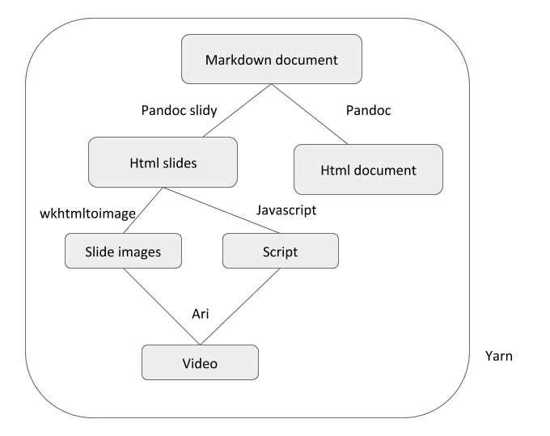

# Automatic generation of material from Markdown document

Framework to generate HTML, slides (HTML, pdf, images) and narrated videos (using ari) from markdown.


## Installation

Download and install https://wkhtmltopdf.org/downloads.html

### In the terminal

Download and install miniconda https://docs.conda.io/en/latest/miniconda.html

Run 'script/install.sh'


## Configuration

To use the video generation function, you need AWS identifiers.
Add them at the beginning of the Jakefile in the lines:

```
const acc_key = ""  /** enter your AWS_ACCESS_KEY_ID */
const secret_key = "" /** enter your AWS_SECRET_ACCESS_KEY */
```


## Usage

Write Markdown source files in `src/*.md`.

Jake tasks exist to generate slides in html, pdf, image, and video. For example,
to generate from the markdown file `src/How-to.md` run (From the base directory):

- HTML slides: `yarn jake dist/How-to-slides.html`
- HTML  full page: `yarn jake dist/How-to-document.html`
- Video: `yarn jake dist/How-to.mp4`


## Document structure

### Class and Id tags


Class :
```
:::::::::{ .name_class}

Block of content

::::::::::::::::::

# Line of content{ .name_class}

```

Id
```
:::::::::{ #name_id }

Block of content

::::::::::::::::::

# Line of content{ #name_id }
```

To end a block, the number of colons in the end line must be superior to the number of colons in the start line.

### Support specific classes

To display content only in the main document, use `{ .document}`

To display content only in the slides, use `{ .slide_only}`

To mark the content to be spoken in the videos, use `{ .spoken}`

## Workflow




**Markdown to HTML : Pandoc**
-   Universal document converter
-   Highly configurable
-   Allows the creation of self contained html with different css files
-   We use a different css file for the Main document and the slides

The original document is written in Markdown, and we can create two documents from it. One is the full hands-on document, and the other is a slide show. We perform these conversion using the Pandoc tool. It allows the use of css without including it in the markdown, allowing to have a neutral original material for all supports.


**HTML slides to slide images : wkhtmltoimage**
-   Extract one image per HTML slide
-   Independant of how we build the HTML


**Extraction of speech text : extract-script-from-html.js**

Once we generated the slide show document, we extract the text dedicated to the text-to-speech. They are identified by special tags in the markdown document. We parse the html document with a javascript script to extract the text destined to be spoken. From this content, we create a script file, with a line corresponding to the speech of a slide.


**HTML slides to slide images : wkhtmltoimage**
-   Extract one image per HTML slide
-   Independant of how we build the HTML


From the same HTML slide show, we extract one image per slide, using wkhtmltoimage. This tool has one great advantage : it is not dependent on how we built our HTML, making it very adaptable. We now have one image, and one line per slide in the script file.


**Images and script to video : [Ari](https://github.com/jhudsl/ari) R package (`run_ari_spin.R`)**
-   From a html and a a text file, producte a video with voice over

From this 2 parts, we assemble the video with ari package. Ari is a R package that uses Amazon Polly services to convert text to speech, and stiches together voice and images to produce a video. It is developped in Johns Hopkins Data Science Lab. As the script file used to generate the video contains one line of text per slide, it is easy to modify it  to generate subtitles.


**Call of creation rules : Yarn**
-   All the tools are encapsulated in scripts managed with yarn. The rules are described in the file  name Jakefile.

```

/** Default task: build HTML slides */
task('slides-html', ['dist/%-slides.html'])


/** Default task: build full page HTML document */
task('document-html', ['dist/%-document.html'])

/** Build PDF files from slides */
task('slides-pdf', ['dist/%-slides.pdf'])

/** Build images */
/** task('slides-img', ['dist/%.001.png']) */

/** Build script */
/** task('slides-script', ['dist/%.script']) */


/** Build video files */
task('slides-video', ['dist/%-slides.mp4'])

```

The function is called by the command `yarn jake dist/{name of markdown file}{extension of the file to create}`. The extension is recognised to call the adapted workflow of creation.

*E.g.:*
-   The source markdow is called `Tutorial.md`
-   To create the HTML slides, I use the command `yarn jake dist/Tutorial-slides.md`
-   To create the full page HTML, I use the command `yarn jake dist/Tutorial-document.html`
-   To create a pdf of the slides,  I use the command `yarn jake dist/Tutorial-slides.pdf`
-   To create the video, , I use the command `yarn jake dist/Tutorial.mp4`
    -   This command also execute the creation of HTML slides, the scipt, and the images.

The rules for creating the files are defined in Jakefile as well:

```

 /** Build slides HTML from Markdown with pandoc */
 rule(`dist/%-slides.html`, 'src/%.md', ['src/slides.css'], function () {
   exec(`pandoc --webtex -t slidy${slidy_style} ${this.source} -f markdown${md_style} \
            -o ${this.name} --self-contained --css src/slides.css 2>&1`)
 })

{...}

/** Build video from images and script using ari */
rule(`dist/%.mp4`, `dist/%.001.png`, function () {
  let basename = this.name.substring(0, this.name.lastIndexOf('.'))
  // Run ari
  exec(`./scripts/run_ari_spin.R ${this.name} ${basename}.script ${acc_key} ${secret_key} ${basename}.*.png 2>&1`)
})


```

# Markdown formating


The document contains :
-   Content common to all supports
-   Content displayed in the Slides
-   Content displayed in the Document
-   Content destined to text-to speech


This document will contain four sets of content : The biggest set is the common core between all supports. There are two mutually exclusive sets corresponding to the content to be displayed only in the slide show, or only in the hands-on document. The last set contain paragraphs destined to be read by the artificial voice. This set can often overlap with the explanatory text dedicated to the hands-on document. These set are identified by Markdown tags.


## Special styles


```

:::::{ .class}
For a special block of Text.
::::::::

[For a special line]{ .class}

```


Class :  ``{ .name_class}``

Id : ``{ #name_id }``


In this version of pandoc, you can tag a container with a class name or ID between curly brackets. The containers limits are defined by square brackets in case of in-line content, and with flanking colons for special paragraphs. The start of the paragraph is marked with at least three colons, and the end by the next line of colons containing more colons than the first one.
The name between brackets are the names of the style that will be applied to the content.
A content class is identified by a period followed by the class name, and its ID is identified by a hashtag followed by the ID.


## Header


```

---
title: "How to build a wonderful presentation"
author: "Miss Bumblebee"
---

```


In Pandoc, One Basic structure of the document is the header. It contains metadata about the document, and generally require a title, date, and authors. It is used to build a cover slide containing the metadata. For the moment, this slide is deactivated because it causes problems with the parsing looking for speech paragraphs. The video cannot be built with a discordance between the number of slides and the lines of text. As we cannot modify the title slide, we can't  generate enough lines for the voice.


## Slides structure

A new slide is created for each level 1 header `# Header`.

To avoid the repetition of titles in the Main Document, use the `.slide_only` class.

```
# [Document Structure ]{ .slide_only}
```


If you wish to hide a whole slide, use the `.slide_only` as such :

```
# Document Structure { .slide_only}
```

Contrary to other conversion tools, you do not need to insert a line to separate slides in pandoc markdown. The change of slide is done at each top level header. This permits to  not have random lines appearing in the hands-on  document. If you wish to continue display a title across several slides, use the slide only tag to hide the additional titles in the main HTML document. You can also use the same tag on the main slide title to silence the whole slide.


## Sets marking

Class tags
-   `.document` :  in the hand-on document and not in the slide show
-   `.slide_only` : in the slide show and not in the hand-on document
-   `.spoken` : is read by the text-to-speech in the video


The three tags used to mark the different sets of content are : document, slide only, and spoken. They can be used interchangeably for paragraphs or in line text. The document tag hide the content of the block in the slide show, but displays it in the hands-on document.
The slide_only tag hide the content in the hand-on document and display it in the slide show.


# Formatting with css

Once we have clearly delimited the different sets in the main document, the generation of the html will cleanly detangle them. CSS files, used to explicitate the format of our documents, is where the hiding and displaying takes place.
We hide the different content by changing the display and visibility parameters of each class.
That is were a standalone HTML file is useful, the css is passed as an argument to the pandoc tool, and does not need to be specified in the Markdown document. It allows to truly have the same original document for all supports.


Two separate css :
-   One for the slides
-   One for the Hands-on document


**The .document class** :

-   In the slide css
```css
.document {
  display: none;
}
```
-   In the document css
```css
.document {
  display: block;
  padding: 0.5rem;
  justify-content: center;
}
```


**The .slide_only class**

-   In the slide css
```css
.slide_only {
  display: inline ;
  visibility:  visible ;
}
```

-   In the document css
```css
.slide_only {
  display: none !important;
  visibility: hidden  !important;
  position: static;
}
```


**References :**
-   Ari : [https://github.com/jhudsl/ari](https://github.com/jhudsl/ari)
-   Pandoc : [https://pandoc.org/](https://pandoc.org/)
-   wkhtmltoimage : [https://wkhtmltopdf.org/](https://wkhtmltopdf.org/)


**Authors :**
-   Delphine Larivière
-   Frederick Tan
-   John Muschelli
-   James Taylor
-   Jeff Leek
-   The Galaxy Project
